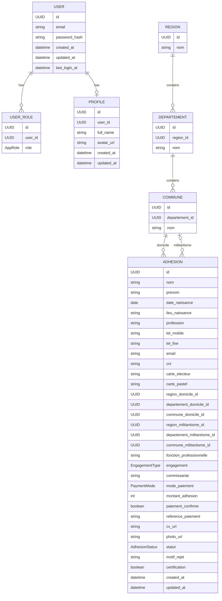
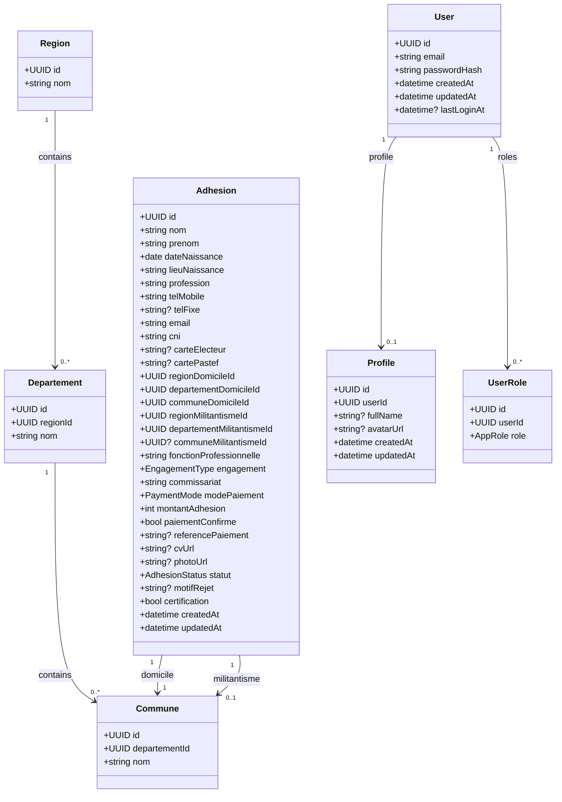

# Modèles Backend (cible) — MONCAP

Ce document synthétise les modèles métier actuellement implicites dans le projet (anciennement stockés dans Supabase) afin de faciliter la migration vers un backend propriétaire.

## Contexte de l’application

- Le site public permet de soumettre une demande d’adhésion (formulaire multi‑étapes) et de suivre l’état d’un dossier par email.
- Un espace admin permet de consulter les demandes, filtrer, exporter en CSV, et mettre à jour le statut (validation/rejet/demande de complément).

Références code :
- Routes : [App.tsx](file:///n:/OneDrive%20-%20Université%20Cheikh%20Anta%20DIOP%20de%20DAKAR/React_Project/moncap/src/App.tsx)
- Soumission adhésion : [Adhesion.tsx](file:///n:/OneDrive%20-%20Université%20Cheikh%20Anta%20DIOP%20de%20DAKAR/React_Project/moncap/src/pages/Adhesion.tsx)
- Suivi : [Suivi.tsx](file:///n:/OneDrive%20-%20Université%20Cheikh%20Anta%20DIOP%20de%20DAKAR/React_Project/moncap/src/pages/Suivi.tsx)
- Admin : [Admin.tsx](file:///n:/OneDrive%20-%20Université%20Cheikh%20Anta%20DIOP%20de%20DAKAR/React_Project/moncap/src/pages/Admin.tsx)

## Enums

### AdhesionStatus

- `en_attente`
- `validee`
- `rejetee`
- `complement`

### EngagementType

- `politique`
- `syndicalisme`
- `societe_civile`
- `autre`

### PaymentMode

- `wave`
- `orange_money`
- `free_money`
- `carte_bancaire`
- `prelevement_bancaire`
- `especes`

### AppRole

- `admin`
- `moderator`
- `user`

## Modèles (entités)

### Région / Département / Commune (Référentiel géographique)

Objectif : normaliser les localisations pour pouvoir créer des relations fiables entre régions, départements et communes (et éviter les chaînes de caractères libres).

#### Region

Champs :
- `id: UUID`
- `nom: string` (unique)

#### Departement

Champs :
- `id: UUID`
- `region_id: UUID` (FK → `Region.id`)
- `nom: string` (unique dans une même région)

#### Commune

Champs :
- `id: UUID`
- `departement_id: UUID` (FK → `Departement.id`)
- `nom: string` (unique dans un même département)

### Adhesion (Demande d’adhésion)

Objet central : une candidature.

Champs (types indicatifs) :
- `id: UUID`
- `nom: string`
- `prenom: string`
- `date_naissance: date`
- `lieu_naissance: string`
- `profession: string`
- `tel_mobile: string`
- `tel_fixe?: string | null`
- `email: string`
- `cni: string`
- `carte_electeur?: string | null`
- `carte_pastef?: string | null`
- `region_domicile_id: UUID` (FK → `Region.id`)
- `departement_domicile_id: UUID` (FK → `Departement.id`)
- `commune_domicile_id: UUID` (FK → `Commune.id`)
- `region_militantisme_id: UUID` (FK → `Region.id`)
- `departement_militantisme_id: UUID` (FK → `Departement.id`)
- `commune_militantisme_id?: UUID | null` (FK → `Commune.id`)
- `fonction_professionnelle: string`
- `engagement: EngagementType`
- `commissariat: string`
- `mode_paiement: PaymentMode`
- `montant_adhesion: number` (défaut: 25000)
- `paiement_confirme: boolean` (défaut: false)
- `reference_paiement?: string | null`
- `cv_url?: string | null`
- `photo_url?: string | null`
- `statut: AdhesionStatus` (défaut: `en_attente`)
- `motif_rejet?: string | null`
- `certification: boolean` (défaut: false)
- `created_at: datetime`
- `updated_at: datetime`

Règles et validations (recommandées côté backend) :
- `email` au format email, normalisé (trim + lowercase).
- `tel_mobile` non vide (format libre actuellement).
- `certification` doit être `true` pour accepter une soumission.
- `montant_adhesion` doit être >= 0 (valeur attendue : 25000).
- Si `statut = rejetee`, `motif_rejet` doit être renseigné (recommandé).
- Le frontend upload 2 fichiers : photo + CV ; aujourd’hui, les URLs sont stockées directement dans `cv_url` et `photo_url`.
- Cohérence géographique :
  - `departement.region_id` doit correspondre à `region_*_id`.
  - `commune.departement_id` doit correspondre à `departement_*_id`.

### User (Compte d’administration)

Le frontend a une page de connexion admin. Dans le code actuel, l’authentification est faite via Supabase Auth (email/mot de passe). Pour un backend propriétaire, il faut un modèle `User` (même si seuls les admins sont utilisés au départ).

Champs (proposition minimale) :
- `id: UUID`
- `email: string` (unique)
- `password_hash: string`
- `created_at: datetime`
- `updated_at: datetime`
- `last_login_at?: datetime | null`

### Profile (Profil utilisateur)

Actuellement, un profil est créé automatiquement au signup (trigger Supabase). C’est optionnel pour la v1 si tu ne gères que des comptes admin.

Champs :
- `id: UUID`
- `user_id: UUID` (unique)
- `full_name?: string | null`
- `avatar_url?: string | null`
- `created_at: datetime`
- `updated_at: datetime`

### UserRole (Attribution des rôles)

Mapping many-to-many entre `User` et `AppRole` (un user peut avoir plusieurs rôles).

Champs :
- `id: UUID`
- `user_id: UUID`
- `role: AppRole`

Contraintes :
- unique `(user_id, role)`

## Relations (ERD)

Notes :
- `ADHESION` est indépendante de `USER` dans le modèle actuel (pas de compte côté demandeur). Le suivi se fait par `email`.
- Le référentiel `Region` → `Departement` → `Commune` permet de sécuriser les saisies et de simplifier les filtres (par jointures).

## Diagramme de classes (métier)

## Cas d’usage backend (contrats minimaux attendus par le frontend)

Endpoints proposés (à ajuster à ta stack) :
- Public
  - `POST /adhesions` : créer une adhésion (+ upload fichiers ou URLs)
  - `GET /adhesions?email=...` : lister les adhésions d’un email (tri desc)
- Admin (protégé)
  - `POST /auth/login` : login admin (email/mot de passe)
  - `POST /auth/logout`
  - `GET /admin/adhesions` : liste + filtres (statut, commissariat, date, search)
  - `PATCH /admin/adhesions/:id` : mise à jour statut + motif
  - `GET /admin/adhesions/export.csv` : export CSV

Règle d’accès :
- Lecture/écriture admin uniquement sur les endpoints `/admin/*`.
